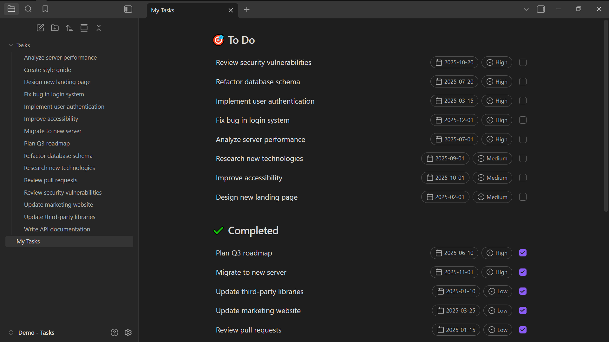
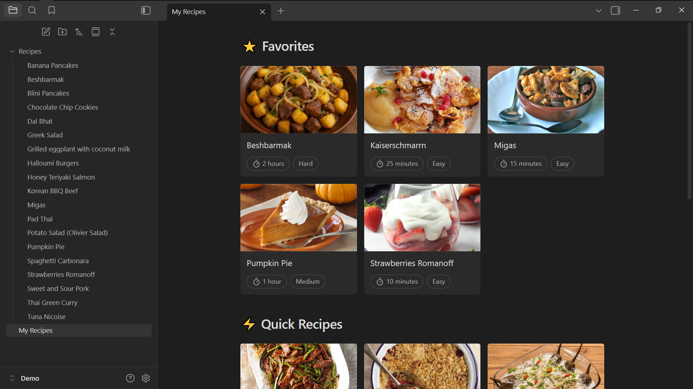
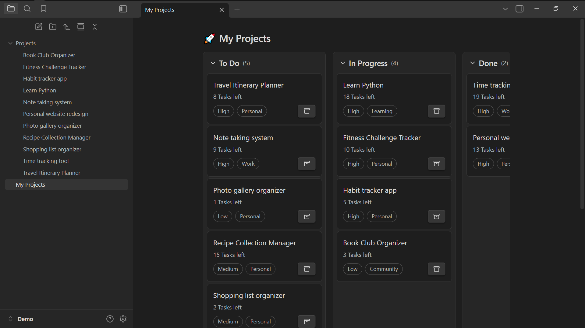

<h1 align="center">DataBlock</h1>
<p align="center"> <strong>Transform your Obsidian vault data into interactive, customizable layouts</strong> </p>
<p align="center">
<a href="https://obsidian.md">
    
  </a>
  <a href="https://github.com/majd3000/datablock/releases/latest">
    
  </a>
  <a href="https://github.com/majd3000/datablock/releases">
    
  </a>
  <a href="https://ko-fi.com/majd3000" target="_blank">
    
  </a>
</p>
 <p align="center">  </p>

## 🌟 Overview
This [Obsidian](https://obsidian.md) plugin offers different view types to display your data as List, Gallery, or Kanban Board layouts. It’s great for displaying tasks, showcasing collections, and tracking project progress in customizable views.

### ✨ Key Features
- **Three View Types** - Choose between List, Gallery, and Kanban Board layouts to match your content
- **Flexible Data Source** - Pull from vault folders or write custom JavaScript for more possibilities
- **Smart Filtering** - Apply complex filters with AND/OR logic to find exactly what you need
- **Interactive Elements** - Add clickable pills to show note properties and action buttons for quick tasks
- **Edit in Place** - Update frontmatter properties directly without opening individual notes

---

## 🚀 Quick Start

**Manual Installation**
1. Download the latest release
2. Extract to `.obsidian/plugins/datablock/`
3. Enable in Settings → Community Plugins


### Creating Your First Datablock

**Using the Configuration Modal (Recommended)**

- Press `Ctrl/Cmd + P` → "DataBlock: Create New Datablock"
- Configure through tabs, click "Next" until done

**Manual Configuration**

create a `datablock` code block directly:
````markdown
```datablock
view: list
folder: "Your Folder"
```
````

---

## 📋 View Types

### 🗂️ List View

Create organized lists with interactive elements, filtering, and sorting.



### 🖼️ Gallery View

Display visual content like images, recipes, portfolios, and media collections.



### 📊 Board View

Kanban-style boards for project management and workflow visualization



> **Note:** Drag and drop updates the note's frontmatter property automatically


---

## 💡 Usage Examples

### 📝 Tasks

Create a task list to organize tasks with due dates and priorities, while hiding completed ones.

````markdown
```datablock
view: list
folder: Tasks
title:
  text: item.name
  action: item.path
pills:
  - text: '{{icon:calendar}} {{property:due}}'
    action: edit-property
    propertyType: Date
  - text: '{{icon:circle-dot}} {{property:priority}}'
    action: edit-property
    propertyType: Select
    options:
      - High
      - Medium
      - Low
buttons:
  - action: edit-property
    property: completed
    propertyType: Boolean
    checkboxMode: true
filters:
  - type: property
    field: completed
    operator: is-not
    value: 'true'
sort:
  by: property:priority
  order: asc
```
````

<details> <summary>📁 Example File Structure</summary>

```
Tasks/
├── Fix bug in login system.md
├── Design new landing page.md
└── Review pull requests.md
```

**Frontmatter Example:**

```yaml
---
completed: false
due: 2025-12-01
priority: High
---
```

</details>

### 🍳 Recipes

Display your favorite recipes in a gallery view with cooking times, and difficulty ratings.

````markdown
```datablock
view: gallery
folder: Recipes
title:
  text: item.name
  action: item.path
pills:
  - text: "{{icon:timer}} {{property:cook_time}}"
  - text: property:difficulty
coverProperty: image
```
````

<details> <summary>📁 Example File Structure</summary>

```
Recipes/
├── Spaghetti Carbonara.md
├── Chocolate Chip Cookies.md
└── Thai Green Curry.md
```

**Frontmatter Example:**

```yaml
---
image: "https://example.com/carbonara.jpg"
cook_time: "30 minutes"
difficulty: "Medium"
---
```

</details>

### 📊 Projects

Organize projects in a Kanban board with status columns and priority levels

````markdown
```datablock
view: board
folder: Projects
title:
  text: item.name
  action: item.path
pills:
  - text: property:status
  - text: property:priority
sort:
  by: property:priority
  order: asc
customGroups:
  property: status
  groups:
    - To Do
    - In Progress
    - Done
```
````

<details> <summary>📁 Example File Structure</summary>

```
Projects/
├── Website Redesign.md
├── Mobile App Development.md
└── Database Migration.md
```

**Frontmatter Example:**

```yaml
---
status: To Do
priority: High
---
```

</details>

### 🌐 External Data Integration

Fetch and display data from external APIs, like Hacker News headlines.

````markdown
```datablock
view: list
data: |-
  const api = 'https://hacker-news.firebaseio.com/v0';
  
  try {
    const topIds = await fetch(`${api}/topstories.json`).then(r => r.json());
    const stories = await Promise.all(
      topIds.slice(0, 10).map(id => 
        fetch(`${api}/item/${id}.json`).then(r => r.json())
      )
    );
    
    return stories.map(story => ({
      name: story.title,
      score: story.score,
      author: story.by,
      url: story.url,
      comments: story.descendants || 0,
      time: new Date(story.time * 1000).toLocaleDateString()
    }));
  } catch (error) {
    console.error('Failed to fetch news:', error);
    return [];
  }
title:
  text: property:name
  action: function(item) { window.open(item.url, '_blank'); }
pills:
  - text: '{{icon:user}} {{property:author}}'
  - text: '{{icon:arrow-up-circle}} {{property:score}} points'
```
````

---
## 🔧 Configuration Reference

### Basic Properties
| Property  | Description                              | Example              |
| --------- | ---------------------------------------- | -------------------- |
| `view`    | Display type: `list`, `gallery`, `board` | `view: list`         |
| `folder`  | Source folder path                       | `folder: "Projects"` |
| `data`    | Custom JavaScript data function          | `data: () => [...]`  |
| `filters` | Filter conditions array                  | `filters: [...]`     |
| `sort`    | Sorting configuration                    | `sort: [...]`        |

### View-Specific Options

#### Gallery View
- `columns`: Number of columns (1-6)
- `coverProperty`: Property for cover images

#### Board View
- `groupByProperty`: Property to group by
- `customGroups`: Custom column definitions

### Interactive Elements
| Element       | Purpose               | Configuration                         |
| ------------- | --------------------- | ------------------------------------- |
| `title`       | Item headers          | Text, click actions                   |
| `description` | Item descriptions     | Text, click actions                   |
| `pills`       | Display metadata tags | Text, click actions, property editing |
| `buttons`     | Action triggers       | Text, click actions, menu options     |

### Template Syntax
Use double curly braces for dynamic content:
- `{{property:fieldName}}` - Display frontmatter property value
- `{{icon:iconName}}` - Display Lucide icon
---

## 🛠️ Capabilities

### Custom Data Sources

Write JavaScript to fetch data from APIs or create computed datasets:

```js
data: |-
  // Fetch from API
  const response = await fetch('https://api.example.com/data');
  const data = await response.json();
  
  // Transform data
  return data.map(item => ({
    name: item.title,
    category: item.type,
    date: new Date(item.created_at).toLocaleDateString()
  }));
```

### Property Editing

Enable inline property editing with type validation:

```yaml
pills:
  - text: |-
      function(item) {
        return `Status: ${item.status}`
      }
    action: edit-property
    propertyType: Select
    property: status
    options: ["Todo", "In Progress", "Done"]
```

### Filtering and Sorting

Create complex filter conditions:

```yaml
filters:
  - property: "priority"
    operator: "is"
    value: "High"
  - property: "status"
    operator: "is-not"
    value: true
  - type: "custom" 
    function: |-
      return item.tags && item.tags.length > 0;
    
sort:
  by: property:status
  order: desc
```

---
## ❤️ Support

If you find this plugin helpful, consider supporting its development.

<a href="https://ko-fi.com/majd3000" target="_blank">
  
</a>

---
## 📝 License

This project is licensed under the [MIT License](./LICENSE).
